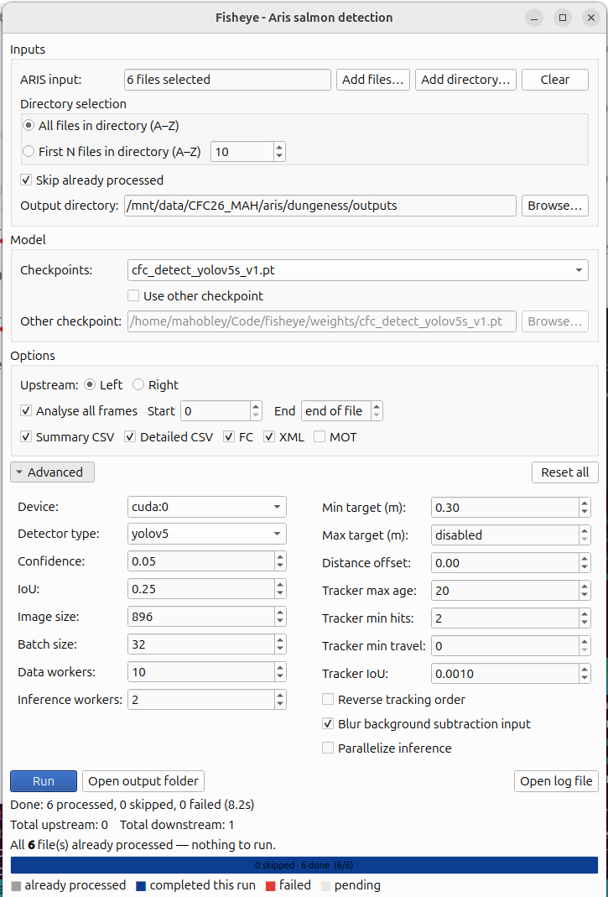

# FishEye

FishEye is a Python library for automated fish counting from imaging sonar data using computer vision. It automates core workflows such as data conversion, preprocessing, inference, and dataset creation, and provides pretrained models for fish detection.

---

## Installation & Setup

### Requirements

* **Python**: 3.10.14 (or 3.8 for NVIDIA Jetson)

  * Recommend using [pyenv](https://github.com/pyenv/pyenv) for Python and virtual environment management
* **Poetry**: [https://python-poetry.org/docs/](https://python-poetry.org/docs/) (dependency management & packaging)
* **PyTorch/torchvision**: If using CUDA, you may need to install a different PyTorch wheel for your CUDA version. Refer to [PyTorch Get Started](https://pytorch.org/get-started/locally/) for the correct installation command.
---

### Environment Setup

1. **Create a virtual environment**

   ```bash
   pyenv virtualenv 3.10.8 fisheye-dev
   ```

2. **Configure Python version with pyenv**

   ```bash
   echo fisheye-dev > .python-version
   ```

3. **Verify the environment is available**

   ```bash
   pyenv versions
   ```

4. **Activate the virtual environment (if needed)**

   ```bash
   pyenv activate fisheye-dev
   ```

5. **Configure Poetry**

   ```bash
   poetry config virtualenvs.create false
   poetry config virtualenvs.in-project true
   poetry config keyring.enabled false
   poetry env use $(which python)
   ```

6. **Install dependencies**

   ```bash
   poetry install
   ```

7. **Activate the environment**

   ```bash
   poetry shell
   ```

   💡 Newer versions of Poetry use:

   ```bash
   poetry env activate
   ```

---

### Pre-commit Hooks

Enable formatting and linting hooks:

```bash
pre-commit install
```

---

### Make the Runner Executable

```bash
chmod +x run.sh
```

---

## Running FishEye

### 1. Select Your Platform Configuration

Open `configs/config.yaml` and locate the `defaults` section:

```yaml
defaults:
  - platform: cpu  # Update with your platform-specific config
  - override hydra/hydra_logging: none
  - override hydra/job_logging: none
```

* The `platform` value **must match a YAML file** in `configs/platform/`.
* You must choose the configuration that corresponds to your **operating system and hardware** (e.g., `cpu`, `cuda`).

💡 Platform-specific settings (e.g., CUDA vs CPU) are defined in `configs/platform/` and may be modified as needed.

Each platform config also defines the model setup:

```yaml
model:
  type: yolov5
  weights: weights/cfc_detect_yolov5s_v1.pt
  device: cuda:0
```

* Model weight paths are relative to the project root.
* Pretrained weights are available as **GitHub release assets**:
  [https://github.com/fisheye-sonar/fisheye/releases](https://github.com/fisheye-sonar/fisheye/releases)

---

### 2. Configure Input and Output Paths

In `configs/config.yaml`, set:

```yaml
input_path:
output_dir:
```

* **`input_path`** may point to:

  * A directory containing multiple `.aris` files, or
  * A single `.aris` file

* **`output_dir`** (optional):

  * If omitted, outputs are written alongside the input files
  * If provided, all outputs are written to this directory

Example:

```yaml
input_path: /home/fisheye/data/
output_dir: /home/fisheye/outputs/
```

---

### 3. (Optional) Configure Export Outputs

Control which outputs are generated using `export_options`:

```yaml
export_options: ["summary_csv", "detailed_csv", "fc", "xml"]
```

Available options:

* `summary_csv` – aggregated summary of counts
* `detailed_csv` – per-file count details
* `fc` – fish count output
* `xml` – MarkedFishMeasurements XML
* `mot` – MOT-style tracking output

Defaults: `summary_csv`, `detailed_csv`, `fc`, `xml`

---

### 4. (Optional) Configure Upstream Direction

When viewing sonar imagery, fish may appear to swim left-to-right or right-to-left. **The image itself does not encode which direction is upstream**—this must be provided as external knowledge.

Set the upstream direction in `configs/config.yaml`:

```yaml
upstream_direction: left  # or right
```

---

### 5. (Optional) Configure Distance Offset

FishEye places markers directly on detected fish by default. You may optionally apply a distance offset (in meters):

```yaml
distance_offset: 0.0
```

* Positive values move markers farther from the sonar
* Negative values move markers closer

---

### 6. Run the Pipeline

From the project root:

```bash
cd ~/home/fisheye/code/fisheye/
./run.sh
```

---

## Desktop App

**Fisheye - Aris salmon detection** is a PySide6 desktop app for running the ARIS salmon detection workflow without editing YAML files by hand. It uses the same underlying FishEye pipeline as the command-line workflow, but exposes the key options in a batch-friendly GUI.



### What the GUI does

* Add one or more `.aris` / `.ddf` files, or point at a directory.
* Choose an output directory and export formats.
* Select a bundled checkpoint from `weights/*.pt` or browse to another `.pt` file.
* Optionally limit the run to a frame range with `start frame` and `end frame`.
* Adjust advanced detector and tracker settings such as confidence, IoU, batch size, min hits, and max age.
* Run single files or batches and monitor per-run totals for upstream and downstream fish.

### Option 1: Use the GUI without building

This is the simplest option if the person using it is comfortable running from source.

1. Install Python `3.10.14`.
2. Install Poetry: <https://python-poetry.org/docs/>
3. Clone this repository.
4. From the repository root, install dependencies including the GUI extras:

   ```bash
   poetry install --with gui
   ```

5. Make sure the model weights you want to use are present in `weights/`.

   Pretrained weights are available from the GitHub releases page:
   <https://github.com/fisheye-sonar/fisheye/releases>

6. Launch the GUI:

   ```bash
   poetry run fisheye-gui
   ```

   Alternative:

   ```bash
   poetry run python -m fisheye_app
   ```

In this mode, logs are written under `logs/` in the repository.

### Option 2: Build a distributable desktop bundle

Use this if you want to hand someone a standalone app folder instead of the full source tree.

Important build assumptions:

* Build on the same operating system you plan to distribute for.
* The provided scripts create a **CPU bundle**. They intentionally fail if the environment still has a CUDA-enabled PyTorch build installed.
* The build output is a folder, not a single installer.

#### Linux build

From the repository root:

```bash
chmod +x scripts/build_cpu_dist.sh
./scripts/build_cpu_dist.sh
```

#### Windows build

From PowerShell at the repository root:

```powershell
.\scripts\build_cpu_dist.ps1
```

#### What the build scripts do

They:

1. Install dependencies with `poetry install --with gui`
2. Check that `torch.cuda.is_available()` is `False`
3. Run PyInstaller with `fisheye_app.spec`
4. Create the distributable folder at `dist/FisheyeArisSalmonDetection/`

You can also run the PyInstaller step manually if needed:

```bash
poetry run pyinstaller --noconfirm --clean fisheye_app.spec
```

#### Before handing the build to someone else

Copy the required model weights into:

```text
dist/FisheyeArisSalmonDetection/weights/
```

At minimum, the distributed folder should contain:

* the built executable files created by PyInstaller
* a `weights/` directory containing the `.pt` checkpoint files you want available in the GUI

#### Running the built app

The recipient does not need Poetry or the full source repository. They can run the executable from inside:

```text
dist/FisheyeArisSalmonDetection/
```

Logs from the built app are written to the per-user application data location rather than the repo `logs/` directory.

---

## Building Training Datasets (Beta)

⚠️ This feature is under active development.

The dataset builder creates image–annotation pairs from **ARIS/DIDSON recordings** and **ARISFish XML exports**.

### Inputs

`DatasetBuilder` expects:

* `aris_dir`: directory containing `.aris` files
* `xml_dir`: directory containing ARISFish XML files

  * Expected naming: `FCe_<ARIS_STEM>_ID_.xml`
* `out_dir`: output directory for images and annotations
* Optional:

  * `dataset_format` (default: YOLO)
  * `padding`
  * `min_padding_px`

---

### Running the Builder

**Option 1: Configure via YAML**

Edit `configs/dataset.yaml`, then run:

```bash
python build_dataset.py
```

**Option 2: Override via CLI**

```bash
python build_dataset.py \
  aris_dir=/path/to/aris \
  xml_dir=/path/to/xml \
  out_dir=/path/to/output
```

---

### Outputs

The builder produces:

* `out_dir/images/` – extracted JPEG frames
* `out_dir/<format>/` – annotations in the chosen dataset format

  * Example: `out_dir/yolo/`

---

## Did you find a bug?
If you're experiencing a bug or unexpected behavior in the FishEye software, please [submit an issue in GitHub](https://github.com/fisheye-sonar/fisheye/issues/new?template=bug_report.md). This helps us identify and fix the issue quickly.
